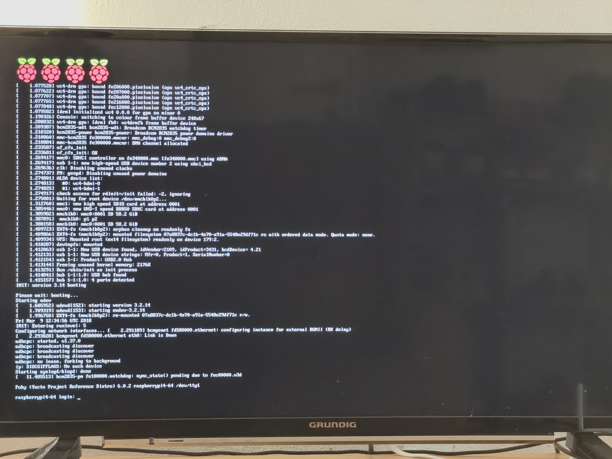
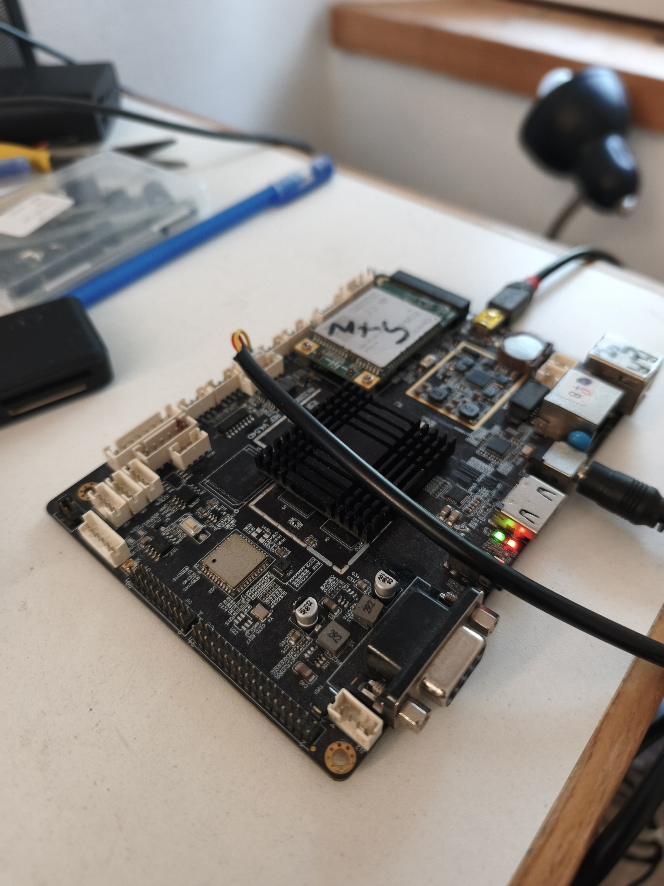

# Building Yocto

A guide to building Yocto for Raspberry Pi 4B and Rockchip RK3288.

## How to use

Read the guides in order. Start with the RPi 4B warm-up to learn the tooling, then pick the RK3288 guide that matches your hardware. Photos for all builds live in `images/`.

## Guides

- [rpi4b.md](rpi4b.md) — RPi 4B `core-image-minimal` on Wrynose 6.0 with the `bitbake-setup` wizard and fragments, in depth: wizard choices, `meta-raspberrypi` layer, firmware license, AppArmor namespace fix, and the `bmaptool` device-path fix.
- [rk3288-evb-scarthgap.md](rk3288-evb-scarthgap.md) — RK3288 EVB on Scarthgap Poky 5.0.15, in depth: layer setup, machine selection, Build 1 `core-image-minimal`, the `usrmerge` and `fiq_debugger` build failures with fixes, Build 2 `rk3288-terminal-image` with HDMI output and tty1 autologin, and flashing with `rkdeveloptool`.
- [rk3288-generic.md](rk3288-generic.md) — generic reference-design RK3288 board, in depth: board and PMIC photos, ACT8846 machine-selection note, Firefly RK3288 boot logs on 6.18, and the status of the port from the EVB config.

## Overview

The last time I used Yocto was in 2024, and I had a steep learning curve setting up the project and building custom images. Since then, much has changed. As of July 2026, setting up projects and building images has become much better organized, simpler, and more intuitive thanks to the new bitbake-setup wizard and fragments.

Previously, I was ambitious and dove directly into building an image for the RK3288 eval board. Mind you, this is not a board from Radxa or Firefly, but a generic RK3288 board based on Rockchip's reference design with only a basic datasheet. Many issues arose during my last attempt, especially with the PMIC, and I was unable to complete the build. It took a lot of time.

This time, I'm taking a simpler approach:
1. Understand the new wizard and fragmentation by building a core-image-minimal for Raspberry Pi 4B (see [rpi4b.md](rpi4b.md))
2. Then take the existing configuration for RK3288 and port it, fixing issues as they arise step by step (see [rk3288-evb-scarthgap.md](rk3288-evb-scarthgap.md) and [rk3288-generic.md](rk3288-generic.md))
