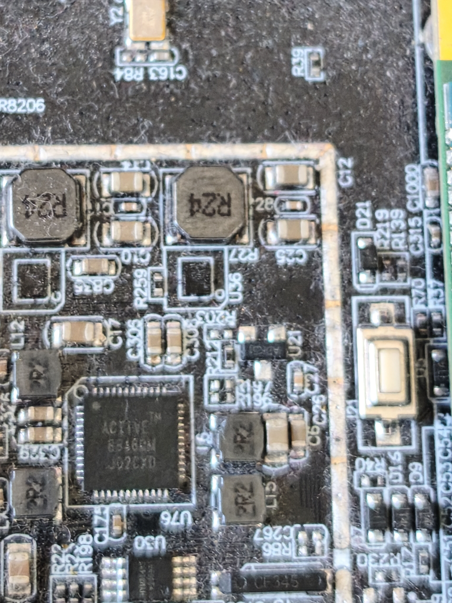
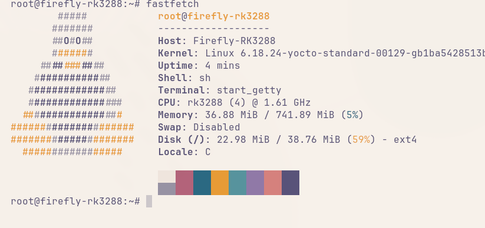
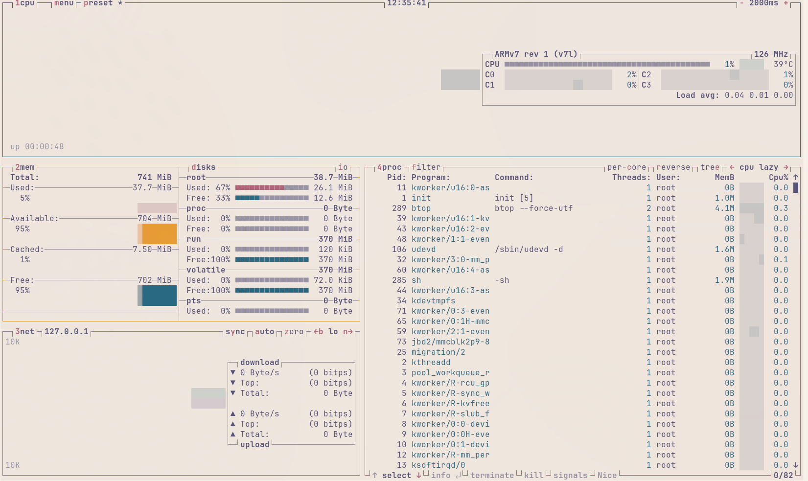

# RK3288 generic reference-design board (Wrynose notes)

This is separate from the Firefly/Rockchip EVB Scarthgap build in `rk3288-evb-scarthgap.md`. That guide uses `rockchip-rk3288-evb` on Poky 5.0.15 with kernel 6.1. This file tracks the generic RK3288 board based on Rockchip's reference design.

## Board

Generic RK3288 board (not Radxa or Firefly), only a basic datasheet.

In 2024 I dove straight into this board and got stuck, especially around the PMIC, and never got a boot. In July 2026 I went back to it after the RPi 4B warm-up (`rpi4b.md`).

## Machine selection note

`meta-rockchip` ships three RK3288 machines:

- `rockchip-rk3288-evb` — standard EVB
- `rockchip-rk3288-evb-act8846` — EVB variant with ACT8846 PMIC
- `rockchip-rk3288w-evb` — low-power RK3288W variant

A generic reference-design board with an ACT8846-class PMIC is closest to the `-act8846` variant. Check your PMIC marking against the close-up above before picking `MACHINE`.

## Boot evidence (Firefly RK3288, Wrynose-era kernel)

The monitor photos below are from a Firefly RK3288 boot of a minimal image: `Firefly-RK3288`, kernel `Linux 6.18.24-yocto-standard`, `rk3288 (4) @ 1.61 GHz`, `~37 MiB / 741 MiB (5%)`, rootfs `~23 MiB / 38 MiB (59%)`.

The serial log visible at the top of `images/rk3288-fastfetch-monitor.jpg` shows `rk_iommu` deferred-probe timeouts, which did not stop the boot to a root shell.

## Status

Generic-board port is still in progress. The EVB Scarthgap guide builds and boots; the remaining work is carrying the PMIC/device-tree delta over to this reference-design board step by step.
